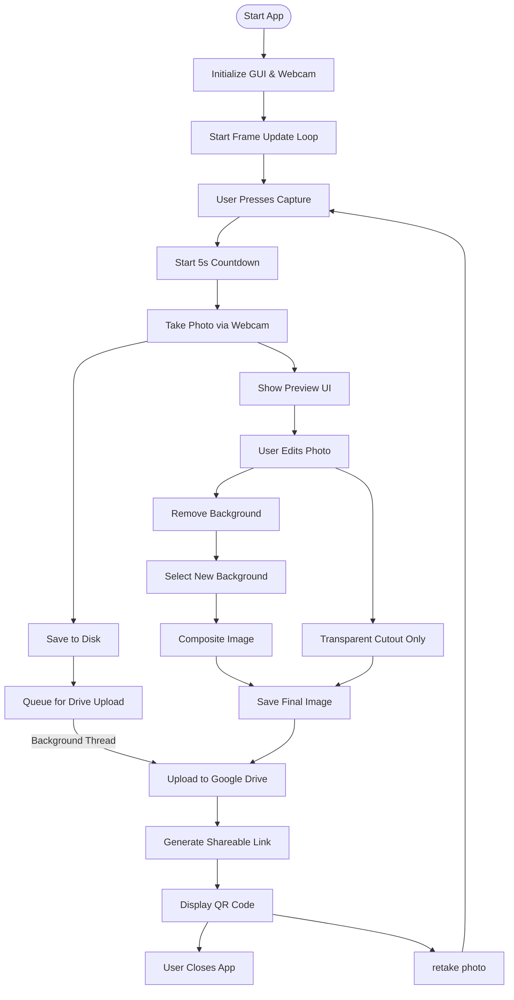

# Photo Booth App Documentation 

## Overview

**This Photo Booth app** is a fullscreen Python webcam photo booth application with the following features:

- Real-time webcam preview
- Countdown timer before capture
- Background removal using rembg
- Custom background selection
- Google Drive uploads (via PyDrive2)
- QR code sharing for downloading images

It integrates:
- **Tkinter** – GUI framework
- **OpenCV** – webcam capture
- **Pillow (PIL)** – image manipulation
- **rembg** – background removal
- **pydrive2** – Google Drive integration
- **qrcode** – QR code generation

---

## Table of Contents

- [DriveManager](#drivemanager)
- [AsyncUploader](#asyncuploader)
- [PhotoBoothPython](#photoboothpython)
- [resource_path Function](#resource_path-function)
- [Flow of the app](#flow-of-the-app)
- [Usage Notes](#usage)

---

## DriveManager

A singleton class that handles Google Drive authorization, connection, and credential management.

### Key Methods

- `__new__()`: Ensures a single instance of the class.
- `__init__()`: Initializes Drive only once.
- `_initialize_drive()`: Authenticates and connects to Google Drive using `mycreds.txt`.
- `get_drive()`: Returns the `GoogleDrive` instance.
- `is_connected()`: Returns connection status.

---

## AsyncUploader

Handles asynchronous uploading of files to Google Drive using a background thread.

### Attributes

- `upload_queue`: Queue holding files to be uploaded.
- `upload_thread`: The upload processing thread.
- `drive_manager`: An instance of `DriveManager`.

### Key Methods

- `start_upload_worker()`: Starts the upload thread.
- `_upload_worker()`: Continuously processes files from the queue.
- `queue_upload(file_path)`: Adds file to the upload queue.
- `_upload_file(file_path)`: Uploads a file to Google Drive.
- `_get_or_create_folder()`: Creates a `PhotoBooth` folder in Drive if not found.
- `upload_and_get_link(file_path)`: Uploads a file and returns a public URL.
- `stop()`: Gracefully stops the upload thread.

---

## PhotoBoothPython

Main GUI class for the application. Handles webcam control, UI, preview, and image operations.

### Initialization

- `__init__(root, title="PhotoBooth")`: Sets up the GUI, webcam, controls, and preview logic.

### Webcam and Preview

- `init_webcam()`: Initializes webcam capture at 1920x1080.
- `update_frame()`: Updates the webcam preview on the GUI.
- `setup_video_label()`: Displays live webcam feed.
- `setup_countdown_label()`: Prepares the countdown text label.

### Countdown

- `start_countdown()`: Starts a 5-second countdown.
- `tick_countdown()`: Decrements the countdown every second.
- `finish_countdown()`: Triggers the photo capture after countdown.

### Capture and Display

- `take_photo()`: Captures image from webcam, saves it, queues upload, shows preview.
- `display_image(img)`: Resizes and shows an image on the webcam area.

### Preview Controls

- `setup_preview_controls()`: Initializes buttons for preview actions.
- `show_preview_controls()`: Makes control buttons visible.
- `hide_preview()`: Hides preview and cleans up QR frame.

### Background Removal

- `capture_background_reference()`: Stores current webcam frame as a background reference.
- `remove_background(input_path, _)`: Removes background using rembg and shows background options.
- `show_cutout(input_path, _)`: Shows transparent cutout, saves and uploads it.
- `show_background_thumbnails(no_bg_img, input_path)`: Displays background thumbnails for selection.
- `reselect_background()`: Reopens background selector if a cutout is available.
- `close_background_selector()`: Closes the background selector panel.

### Save and Share

- `save_final_image()`: Saves the final image (cutout or composited), uploads it, and shows QR code.
- `display_qr_code(url)`: Generates and shows a scannable QR code linking to the uploaded image.

### Controls and Shortcuts

- `setup_control_buttons()`: Adds “Capture” and “Quit” buttons.
- `setup_shortcuts()`: Binds keyboard shortcuts: `Space` for capture, `Esc` for exit.

### Exit Handling

- `on_close()`: Releases webcam, stops upload thread, and closes the app.

---

## resource_path Function

### Purpose

PyInstaller bundles your app into a single `.exe` file and **extracts all files into a temporary folder at runtime**.  
That means regular paths like `"background1.png"` won't work once your app is compiled.

The `resource_path()` function **solves this** by returning the correct path whether the app is running as:

- a **regular Python script**, or  
- a **PyInstaller `.exe`**
### Function Code

```python
def resource_path(relative_path):
    """Returns absolute path to a resource, compatible with PyInstaller."""
    try:
        base_path = sys._MEIPASS  # PyInstaller temp directory
    except Exception:
        base_path = os.path.abspath(".")  # Normal dev mode
    return os.path.join(base_path, relative_path)
```
<br>

## Flow of the app

# Usage

1. **Setup Requirements**  
   - Ensure you have Python 3 installed.  
   - Install required packages:  
     ```bash
     pip install opencv-python pillow rembg pydrive2 qrcode numpy
     ```

2. **Running the App**  
   - Run the app by executing:  
     ```bash
     PhotoBooth.exe
     ```
   - The app opens in fullscreen mode and starts the webcam preview.

3. **Taking Photos**  
   - Press the **spacebar** or click the **Capture** button to start a 5-second countdown.  
   - The webcam automatically takes a photo and saves it locally.

4. **Preview and Edit**  
   - After capture, a preview appears with options:  
     - **Retake Photo:** Discard current photo and return to live webcam.  
     - **Transparent Cutout:** Remove the background to get a transparent PNG.  
     - **Remove Background:** Remove background and select a new background image from thumbnails.  
     - **Save Final Image:** Save the edited image to disk and upload to Google Drive.

5. **Background Selection**  
   - When selecting a new background, click one of the thumbnails shown to composite the person onto the new background.

6. **Uploading and Sharing**  
   - Each saved or edited image is uploaded asynchronously to Google Drive.  
   - A QR code with a shareable link to the uploaded image appears on the top-left corner for easy sharing.

7. **Exiting the App**  
   - Press **Escape** or click the **Quit** button to safely close the app and stop background uploading.

---
